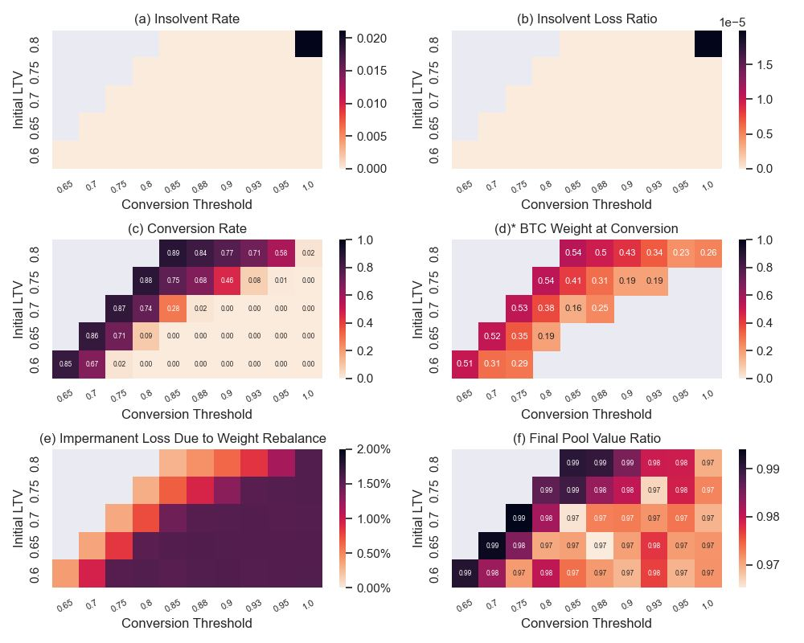
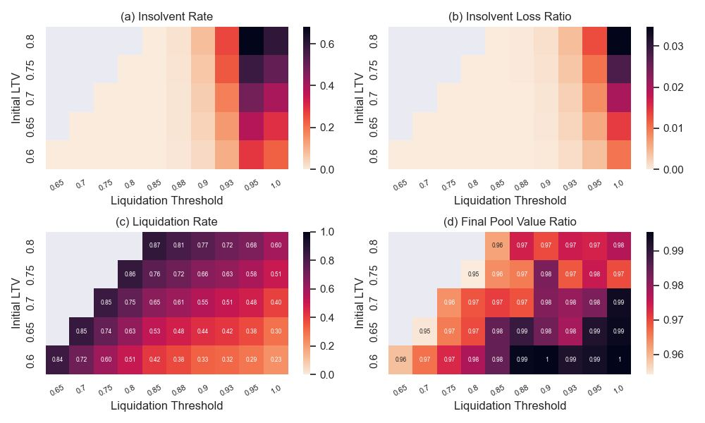
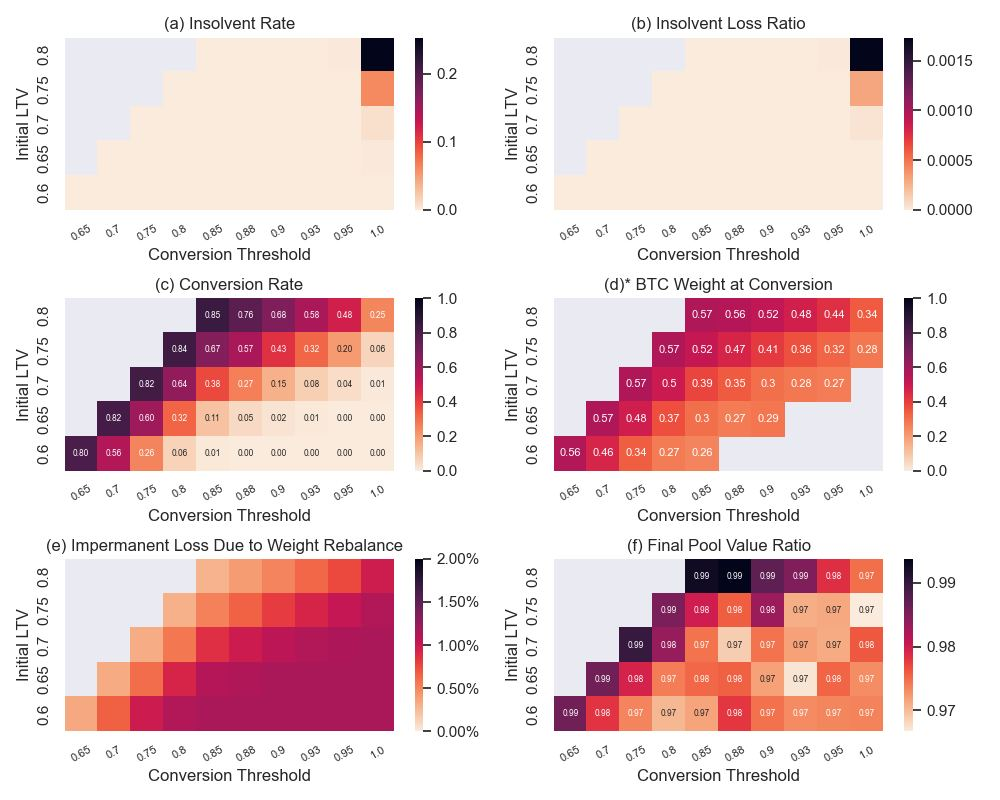
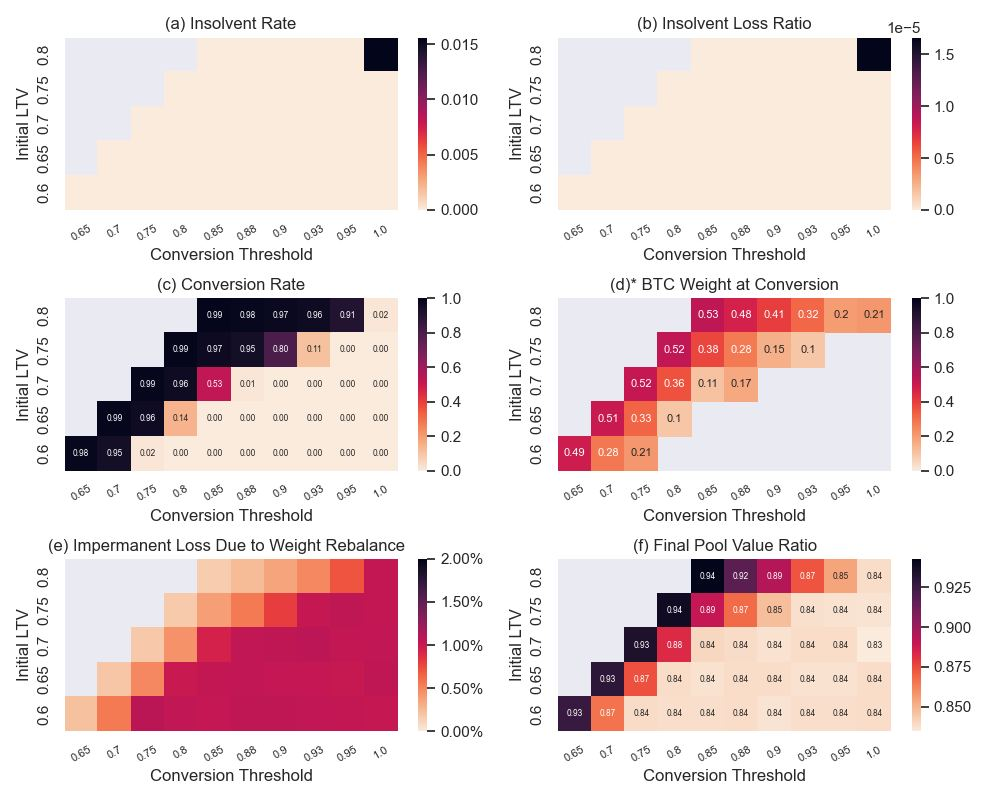
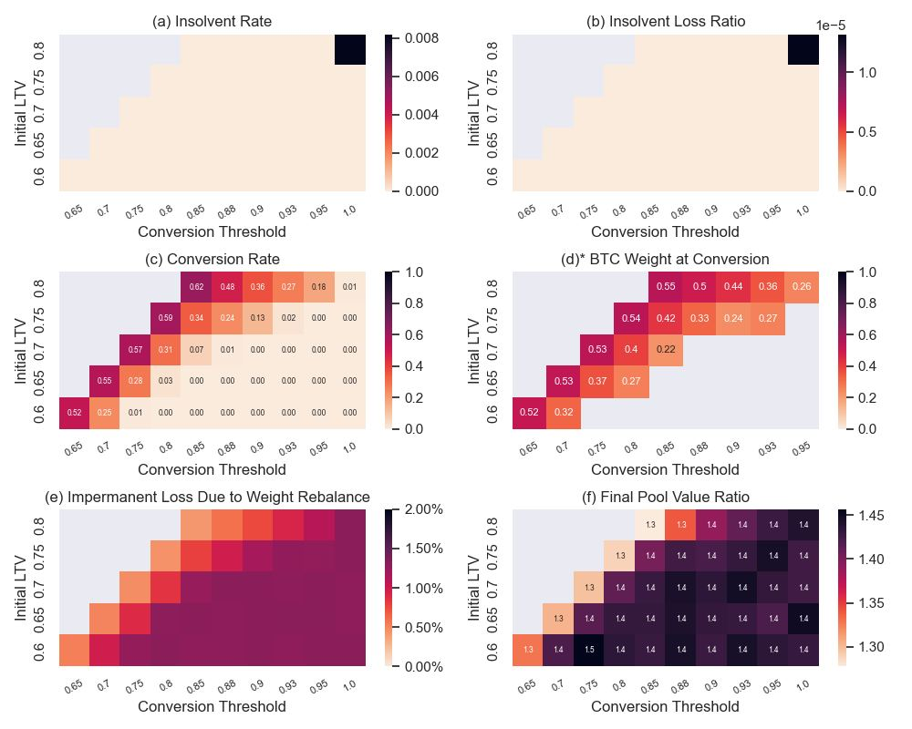

# Dive Into Collateral Rebalancing Pool!

## Introduction

ALEX's collateral rebalancing pools \(CRP\) introduce the concept of portfolio management to DeFi protocols for loanable funds \(PLFs\). A collateral rebalancing pool can hold more than one asset in the collateral pool. Typically, pools hold two assets. One asset is the risky or "collateral" asset, while the other is the riskless or "loan" asset. This design of collateral pools aims to address the most important problem facing PLFs today: under-collateralisation resulting from collateral pool value shrinking significantly during market turmoil

ALEX avoids under-collateralisation and thus liquidation risks through algorithmic rebalancing. As market conditions and the prices of the risky and riskless assets change, a collateral pool is automatically rebalanced to prevent under-collateralisation. During "risk-on" periods, more relative weight is assigned to the risky asset over the riskless asset. During "risk-off" periods,  more relative weight is assigned to the riskless asset over the risky asset. This latter feature ensures that pools cannot become undercollateralised. This dynamic rebalancing, along with other key risk parameters, removes the threat of liquidation. Liquidation often threatens system stability and is extremely costly to market participants. ALEX removes these threats and costs from market participants. 

Due to an abundance of caution, ALEX also maintains a reserve fund to deal with black-swan situations. Although limited by design, a collateral pool's value may drop below the loan's value. Should this happen, the reserve fund would cover any losses. More detail about this reserve fund, and the collateral rebalancing pool system more broadly, is documented in ALEX’s white paper entitled "Automated Marking Making of Collateral Rebalancing Pool".

This report below displays the results of both simulated and real datasets. The results show the strength and robustness of our novel approach to collateral pool management. We exploit the results through an agent-based simulation of various market environments, including both momentum and mean-reversion. We also assess its performance on real data during black-swan events, such as when an underlying risky asset declines massively and abruptly. In our tests, the risky asset is BTC, and the riskless asset is USDC.

## Set-Up

### Key Parameters

Key parameters are discussed in detail in our white paper. While some of them are assumed fixed in this report, such as tenor of the fixed rate contract set at three-month, others are studied in more depth to better understand their impact to CRP. Key parameters that are varied include:

* **Loan-to-Value \(LTV\)**: The ratio of the loan amount to the value of the collateral. For example, if LTV is set to be 80, a loan amount equivalent to 80 BTC requires 100 BTC as collateral. There is generally no objectively correct LTV ratio; the LTV ratio depends on the quality of the collateralised asset, as well as the market condition when the loan is taken out.
* **Implied Volatility**: In the Black-Scholes model, implied volatility is the volatility estimate of an underlying security. A crude approximation of implied volatility is historical volatility. In practise, implied volatility is usually backed out from the observed option price.
* **Rebalancing Frequency**: Theoretically, continuous rebalancing is preferred for price continuity. However, this is impractical due to transaction costs and on-chain implementations. Thus, ALEX updates the weights periodically, e.g. hourly.
* **Conversion Threshold**: This is the LTV level where the risky asset in the collateral pool is completely converted to the riskless asset to prevent the loan from becoming under-collateralised. 

### Evaluation Metrics

We assess performance using the following metrics below, which are functions of the initial LTV and the conversion threshold.

* **Insolvent Rate**: The proportion of loan defaults, i.e. loans becoming under-collateralised.
* **Insolvent Loss Ratio**: Insolvent Loss is the difference between loan value and collateral pool value when a loan defaults. Insolvent loss ratio refers to the average ratio between insolvent loss and initial pool value in terms of USDC.
* **Conversion Rate**: The proportion of time that a "flight-to-quality" occurs, meaning the proportion of time that a risky asset is completely converted to a riskless asset in the collateral pool.
* **BTC Weight at Conversion**: The average weight of BTC when "flight-to-quality" occurs.
* **Impermanent Loss Due to Weight Rebalance**: Total loss of collateral pool value due to weight change divided by the initial pool value in terms of USDC.
* **Final Pool Value Ratio**: The ratio of the collateral pool value between expiry and start of the loan contract.

### Simulation Design

Collateral rebalancing pools, or "CRPs", serve as an agent \(bot\) allocating dynamic weights to risky and riskless assets in a collateral pool. To understand the performance of CRPs, we ran several rigorous simulations. In our simulations, we model the risky asset by way of tracking the underlying BTC price. Specifically, we model the price using the standard and widely accepted form of geometric Brownian motion. This includes two key parameters: BTC's annualized mean $$\mu$$ and BTC's implied volatility $$\sigma$$. These two parameters can be adjusted to reflect various market conditions.

$$\mu$$ controls market direction. Positive/negative $$\mu$$ refers to a market with upward/downward momentum, whereas $$\mu$$= 0 corresponds to mean reversion in a market without obvious trend. $$\sigma$$ represents a market's degree of volatility. In conventional finance, implied volatility is derived from observed option prices. However, option markets for cryptoassets are in their infancy and used by a small number of market participants. Therefore, rather than back-calculating implied volatility, we assume it to be the same as historical volatility. In this report, $$\sigma$$ is set to 80%, which is the average historical volatility of the past five years.

Our results are based on 5,000 simulated paths of BTC prices and hourly rebalancing, variously altering initial LTV and conversion threshold parameters. All the key results are described below. Note that the grey area is not relevant in this study--either the conversion threshold is lower than initial LTV or the metrics are not applicable. 

## Mean-Reverting Market

Mean-reverting markets refer to markets where no clear trend is observed. Simulating mean-reverting markets suggests that the expected price at maturity is equivalent to the initial price. As future price movements are hard to predict, a mean-reverting market with $$\mu$$=0 is the default case when deriving parameters such as option delta.

### Performance

Performance metrics of the simulated ALEX CRP are presented in Figure 1 below. In summary:

* Figure 1 \(a\) and \(b\) show that the insolvent rate and insolvent loss ratio of the ALEX CRP is almost 0, with the exception of an initial LTV close to 0.8 and a conversion threshold close to 1. 
  * Implication: Setting conversion thresholds lower than 0.95 avoids load defaults and liquidations.
* Figure 1 \(c\) highlights that the greater the difference between the initial LTV value and the conversion threshold value, the lower the conversion rate i.e. the more rarely a pool's risky asset is entirely converted into the pool's riskless asset. 
  * A careful selection of conversion thresholds can see conversion rates close to zero, as the collateral pool value would rarely hit the thresholds. 
* Figure 1 \(d\) underscores that the weight of the risky asset goes down when the pool value decreases with the conversion threshold rising. This indicates smoother performance of the collateral pool and helps reducing the loss. 
* Figure 1 \(e\) reveals that the maximum Impermanent loss resulting from rebalancing weights is generally less than 2%. Figure 1 \(f\) highlights that despite a maximum potential 2% impermanent loss, the final pool value is on average within 3% of the initial pool value. This is due to the assumption that the market is mean reverting. 

\(\* Weight is not shown if the conversion rate is &lt; 0.01\)

### Comparison with Single Asset Collateral Pool

ALEX introduces an innovative system to manage collateral pools with two assets. ALEX's system is different from other PLFs. Other PLFs use collateral pools that typically consist of a single asset. We refer to collateral pools with a single asset as static pools. If the value of a static pool falls below a pre-determined threshold, a loan is partially or fully liquidated by a third-party liquidator. Such a threshold is called "liquidation threshold" in our analysis. 

Liquidation thresholds are comparable to the "conversion threshold" of ALEX, meaning the % value of the LTV at which all of the risky asset is converted into the riskless asset. In addition, the "liquidation rate" for a static pool, which is the percentage of time that liquidation occurs, is also similar to the "conversion rate" of ALEX, which is the percentage of time that all of a risky asset has been converted into the riskless asset.

We set a 5% liquidation penalty in the static pool model. This reflects current practice in other PLFs. The liquidation penalty represents an additional loss to the borrower when the loan is subject to liquidation. For example, AAVE’s liquidation penalty ranges between 5% and 15%, depending on the exact collateral asset. We use a conservative 5% penalty, as $BTC has ample liquidity during normal market conditions.

The performance of the static pool is presented in Figure 2. Comparing the static pool's performance to that of ALEX's pool, several insights emerge:

* Additional liquidation penalties increase the chance of borrowers facing insolvency. We reach this insight by comparing data in Figure 2 \(a\) and \(b\) with data in Figure 1 \(a\) and \(b\).
* Because a static pool value drops more than in ALEX's pools when faced with the same market movement, under-collateralised loans occur relatively more often in static pools. This can be seen by comparing the liquidation rate of the static pool in Figure 2 \(c\) and the conversion rate of ALEX in Figure 1 \(c\). Moreover, a static pool is significantly more often required to liquidate up to 100% of the risky asset. During turbulent markets when liquidity dries up swiftly,  this can be challenging. As a result, static pools are significantly more risky than ALEX's pools.
* As seen in Figure 2 \(d\), the final pool value of a static pool is almost the same as the initial pool value. Compared to LEX's pools, static pools are not quite the same in terms of the final pool value, however, as seen in Figure 1 \(f\). Nonetheless, the results of the static pool and of ALEX's pool are both largely due to the mean-reverting assumption in our models. 

### Rebalancing Frequency

Theoretically, continuous rebalancing is ideal. Continuous rebalancing fully captures all price movements. However, continuous rebalancing is not practically possible. On one hand, data might be affected by short term noise, such as prices bouncing back between bids and asks. On the other hand, there can be confirmation lags when trades are executed on-chain. We therefore model a periodic rather than continuous rebalancing frequency.

Figure 3, below, displays the simulation results when rebalancing daily. As expected, rebalancing hourly \(Figure 1\) performs better on most metrics, as the system responds more promptly to price movements.

\(\* Weight is not shown if the conversion rate is  &lt; 0.01\)

## Extreme Downward Market

Extreme downward market conditions, also called black swan events, refer to unexpected and extreme market movements. Usually, these black swan events lead to large loss to a majority of market participants. Black swan events are a systematic risk that cannot be completely hedged. Although ALEX aims to reduce the impact of black swan events through diversification in the collateral pool, industry-wide issues remain. Two issues are particularly critical: \(i\) the pool can be insolvent as the unforeseen shock to the market price is largely one-way and substantial; and \(ii\) liquidity can evaporate swiftly. This is usually accompanied by large price slippages if participants are forced to trade during black swan events. To ALEX pools, trading out of all risky assets might become problematic when liquidity dries up. While the risk is minimized because ALEX pools constantly rebalance, the risk still exists.

### Simulation

We assume an annual return $$\mu$$=-200% in the simulation. This is equivalent to a -50% BTC price drop within our contract loan term of three months.

As shown in Figure 4, although conversion rates of 100% of the risky asset to the riskless asset can be high, pools largely remain solvent. The average weight of the risky asset is around 15% at the conversion given initial LTV 75% and conversion LTV 90%. It demonstrates again that the pool faces less pressure at conversion, even during extreme market condition which could dry up liquidity and increase slippage.

\(\* Weight is not shown if the conversion rate is &lt; 0.01\)

### Case Study: Black Swan Event of March 2020

Due to pandemic and market uncertainty, all risky assets declined sharply in March 2020. On March 12th, 2020, Bitcoin experienced its largest price drop in history – an unprecedented daily change of -49%. How would ALEX's CRP have performed if the contract had been initiated during this black swan event?

Assume a three-month contract. The contract starts on Mar 1st, 2020. Implied volatility is 80%. The pool rebalances hourly. Initial LTV is set at 75%, and the conversion threshold is set at 90%. The strike price is set to be the spot price at 7,956 – the BTC price on the start day.

ALEX CRP pool would have hit the conversion threshold at 12:00 PM, Mar 12th, 2020, when the remaining BTC in pool, whose relative weight had dropped to 44% in the pool, needed to be converted to USDC. With conversions taking place, the pool would have stayed solvent, and final pool value would have had a 83.16% ratio.

While slippage is essential and should be included in the calculation, it is not easy to quantify in such a scenario. Comparatively, our pressure of converting BTC to USDC would have been lower compared to other PLFs because ALEX would have decreased BTC exposure gradually  before the peak of the crisis unfolded.

## Extreme Upward Market

To complete the report and in contrast with the previous analysis of extreme downward market, we also assess the performance of ALEX CRP during market euphoria. We model market euphoria by assuming an annual return $$\mu$$ of +200%. This is equivalent to a 50% BTC price increase within our contract term of three months. The simulation results are presented in Figure 5. The results confirm ALEX CRP’s ability in capturing potential upside gains while minimizing the risk of default.

\(\* Weight is not shown if the conversion rate is &lt; 0.01\)

## Conclusion

This report evaluates the performance of ALEX's CRP via an agent-based simulation for various market environments under different key parameters. In particular, a stress test is implemented to model black swan events. Taken together, we show that ALEX's CRP is able to:

* capture  potential upside gains while limiting the downside market losses 
* eliminate liquidation risks with insolvent rates close to 0 under various market conditions 
* significantly reduce conversion pressure when liquidity shrinks amid market turmoil. 

In short, ALEX's protocol delivers a unique and smooth experience to both borrowing and lending activities by minimizing interruption from market noise. Systematic risk still exists and cannot be fully hedged. However, compared to other PLFs, ALEX's innovative dynamic pool mechanism helps market participants sail smoothly through challenging times and consequently achieve better and more robust returns.

